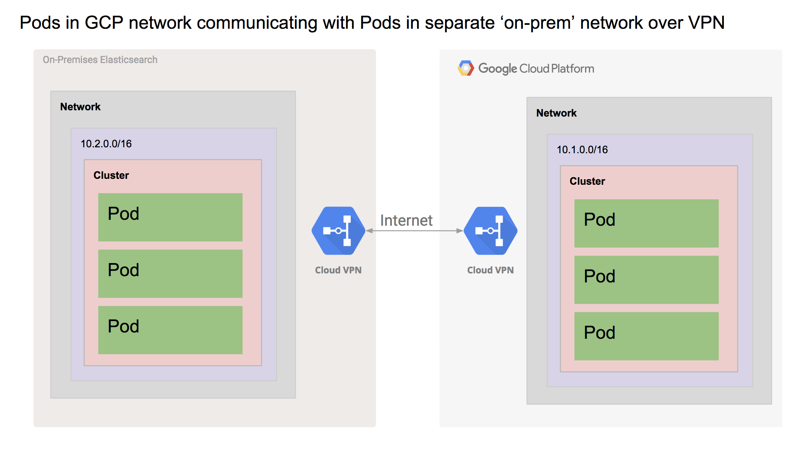

# Connecting to an on-prem Elasticsearch cluster from an application in Google Kubernetes Engine

## Introduction
This demo illustrates best practices and considerations when connecting to your existing on-prem database from a [Google Kubernetes Engine](https://cloud.google.com/kubernetes-engine/) (GKE) cluster.


The key takeaway for this demo is the usage of [Cloud VPN](https://cloud.google.com/vpn/docs/) to connect to your datacenter from your GCP network. Cloud VPN can be used to connect GCP networks to on-prem datacenters or even other GCP networks.


## Architecture
The demo can't contain its own on-prem data center so we have to emulate an on-prem data center by creating a separate VPC network. That on-prem network contains a GKE cluster with a multi-pod Elasticsearch cluster in it. We then build another separate VPC network, the cloud network, that contains an application running in GKE.

The Elasticsearch pods are mapped to the on-prem network address space using [Alias IP ranges](https://cloud.google.com/vpc/docs/alias-ip). This is to simulate a real on-prem cluster and make the nodes reachable without a separate load balancer.

Once the networks are connected the application is able to connect to the 'on-prem' Elasticsearch cluster.



The 'on-prem' datacenter has an eight pod Elasticsearch cluster running in it with separate client, master, and data pods. The data pods are deployed as a StatefulSet. The nodes in the GKE cluster are type n1-standard-4. The manifests were used from the [pires Elasticsearch project](https://github.com/pires/kubernetes-elasticsearch-cluster) with some tuning on memory. 

The cloud datacenter contains another GKE cluster running a single node with a single pod in it.  It is used to demonstrate that the two networks are connected by serving as a minimalist proxy server for the ElasticSearch cluster.

## Prerequisites
### Tools
1. Terraform >= 0.11.7
2. gcloud (Google Cloud SDK version >= 202.0.0)
3. kubectl >= 1.9.7
4. bash or bash compatible shell
5. A Google Cloud Platform project where you have permission to create networks
6. Enable the following gcp services 
   ```
   gcloud services enable compute.googleapis.com
   gcloud services enable container.googleapis.com
   gcloud services enable cloudbuild.googleapis.com
   gcloud services enable containerregistry.googleapis.com
   ```

## Implementation details
1. `Terraform`: used for lifecycle of the GCP infrastructure such as GKE, VPN, network, firewall. 
2. `Bash` with `kubectl`: used for lifecycle of the k8s resources. 
3. `go`: used for any microservice. 

## Run Terraform for Infrastructure Provisioning
```
terraform init
terraform plan
terraform apply
```

1. terraform init 
2. terraform plan - prompts for a shared secret for VPN and makes sure it works
3. terraform apply - prompts for a shared secret for VPN and then builds out the two networks, each with a GKE cluster

After the steps above, we will have a multi-zone GKE cluster to simulate a on prem data center, as well a s a single zone GKE cluster for cloud. 

## Configuration

A context element in a kubeconfig file is used to group access parameters under a convenient name. Each context has three parameters: cluster, namespace, and user. By default, the kubectl command-line tool uses parameters from the current context to communicate with the cluster.

### Generate the k8s contexts in the current project
run `./common.sh` 

### Create an env.sh with the context names

run `kubectl config get-contexts` to find out the GKE cluster names, then create the `env.sh` with the context names returned from the command.
```
ON_PREM_GKE_CONTEXT=<>
CLOUD_GKE_CONTEXT=<>
```

## Infrastructure design highlights

### ElasticSearch service exposed as ILB (Internal Load Balancer)
* (https://cloud.google.com/kubernetes-engine/docs/how-to/internal-load-balancing#create) 
Internal load balancing creates a private (RFC 1918) LoadBalancer Ingress IP address in the cluster for receiving traffic on the network. 

### ElasticSearch GKE Cluster HA set up with regional PD
* [Get higher availability with Regional Persistent Disks on Google Kubernetes Engine](https://cloudplatform.googleblog.com/2018/05/Get-higher-availability-with-Regional-Persistent-Disks-on-Google-Kubernetes-Engine.html?m=1)
* Set up a StatefulSet `es-data` with on a multi-zone GKE cluster (on prem). 
* Check the regional PD as shown below, GKE has created the regional PD for the StatefulSet `es-data`.
```
gcloud beta compute disks list --filter='region'
NAME                                                             LOCATION     LOCATION_SCOPE  SIZE_GB  TYPE         STATUS
gke-on-prem-cluster-f1-pvc-9cf7b9b3-6472-11e8-a9b6-42010a800140  us-central1  region          13       pd-standard  READY
gke-on-prem-cluster-f1-pvc-b169f561-6472-11e8-a9b6-42010a800140  us-central1  region          13       pd-standard  READY
gke-on-prem-cluster-f1-pvc-bcc115d6-6472-11e8-a9b6-42010a800140  us-central1  region          13       pd-standard  READY
```

### what is esproxy?
`esproxy` is a minimalist proxy server for ElasticSearch. The key idea is to proxy the REST request from the cloud GKE cluster to the on premise ElasticSearch cluster. 

#### Build esproxy docker image
`cd esproxy && make container` uses the GCB(Google Container Builder) for building and pushing docker image to gcr.io/${PROJECT_ID}.

## Deploy Kubernetes Resources

Deployment is fully automated except for a single Terraform prompt for user input. This prompt happens at the very beginning of the deploy. In order to deploy you need to run **create.sh**. **create.sh** will run the following commands:

1. on-prem-create.sh - uses kubectl to build the Elasticsearch cluster in the 'on-prem' GKE cluster.
2. cloud-create.sh - uses kubectl to deploy `esproxy` into the cloud GKE cluster.

<!-- The last step in **create.sh** is to port-forward to the running Grafana pod. You can [connect to the port-forwarded Grafana in your browser](https://127.0.0.1:3000). From there you can use the default Grafana username and password (admin/admin) to login to the console. -->


## Validation
1. `./expose.sh` port-forward local traffic to the esproxy pod running in the cloud GKE cluster. 
2. Validate the elasticsearch cluster health
    ```
     curl -s http://localhost:9200/ | jq .
     curl -s http://localhost:9200/es_health | jq .
    ```

## Teardown
Teardown is fully automated. The teardown script deletes every resource created in the deployment script. In order to teardown you need to run **teardown.sh**.

**teardown.sh** will run the following commands:
1. cloud-destroy.sh - destroys the Grafana deployment
2. on-prem-destroy.sh - destroys the Elasticsearch deployments
3. terraform destroy - will destroy the two networks and the GKE clusters

