## Authentication using OAuth 2.0 in Spinnaker 

OAuth 2.0 is the preferred way authenticate and authorize third parties access to your data guarded by the identity provider. 

To confirm your identity, Spinnaker requests access to your email address from your identity provider.

####OAuth providers

Pre-configured providers

For convenience, several providers are already pre-configured. 

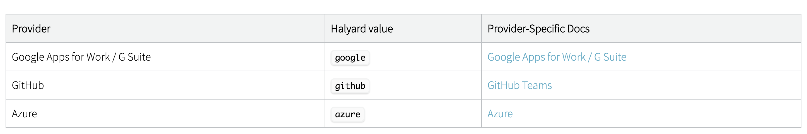

As an administrator, you merely have to activate one, and give the client ID and secret. 

Follow the Provider-Specific documentation to obtain your client ID and client secret.

Activate one by executing the following:

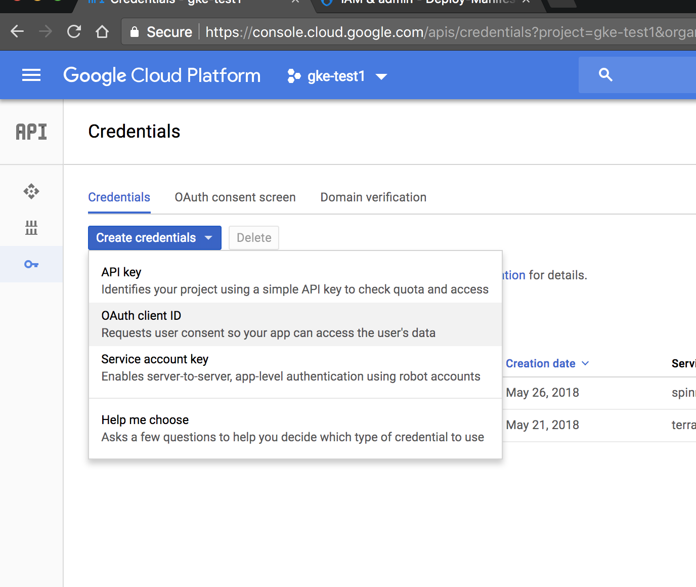

Configure consent screen :

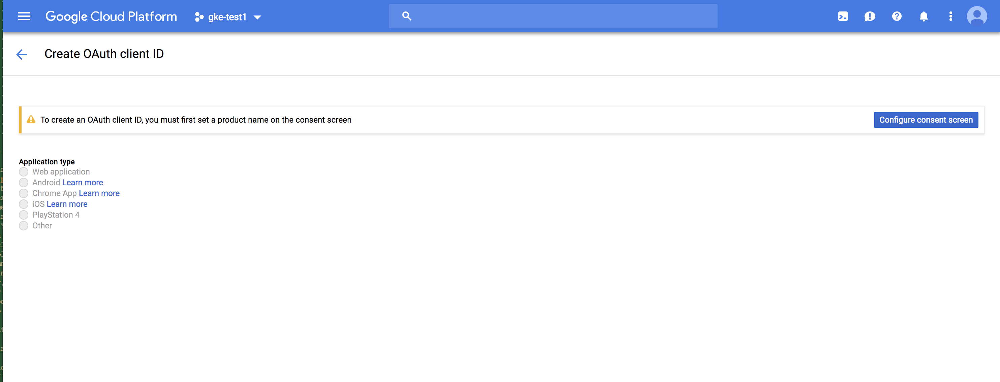

Fill in your google id,name of product
 
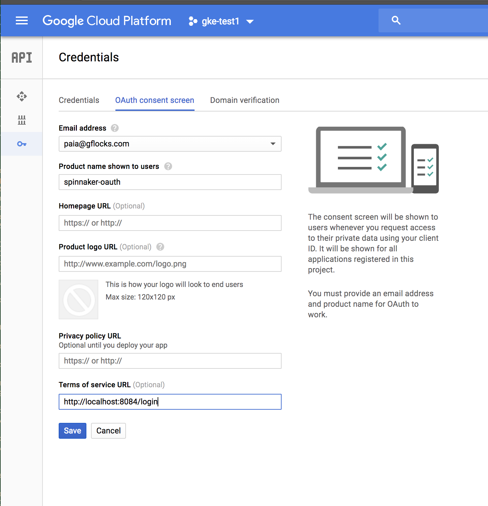

The oauth client id screen will appear URIs

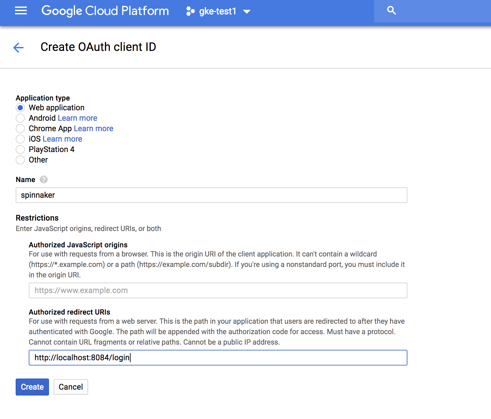

Clicking on `Create` button will generate your client id and client secret key:

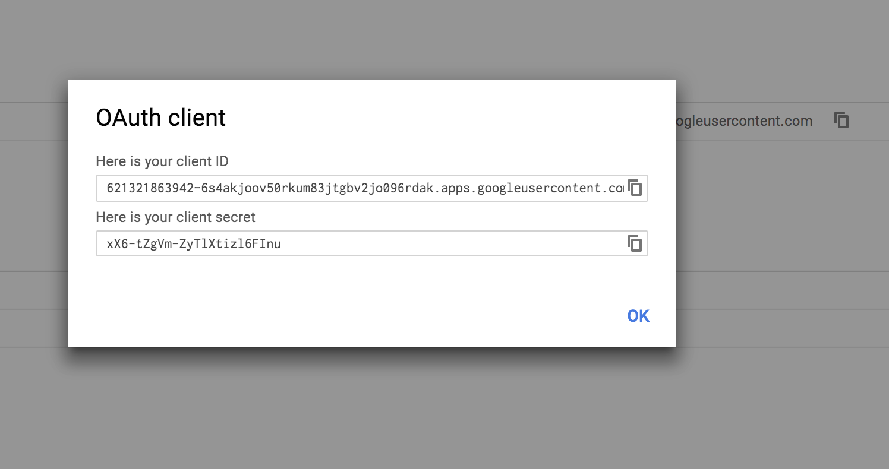

Click `ok` and save those credentials

The Credentials screen will appear with your `saved` credentials

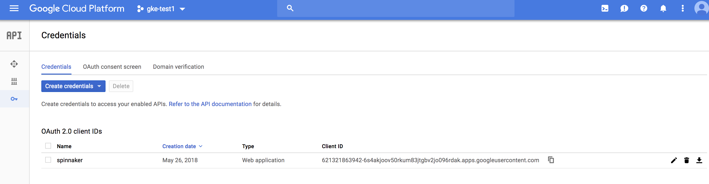

#### Execution of OAuth commands in Halyard for Spinnaker

In your configured Halyard-host already with a spinnaker running without Oauth :

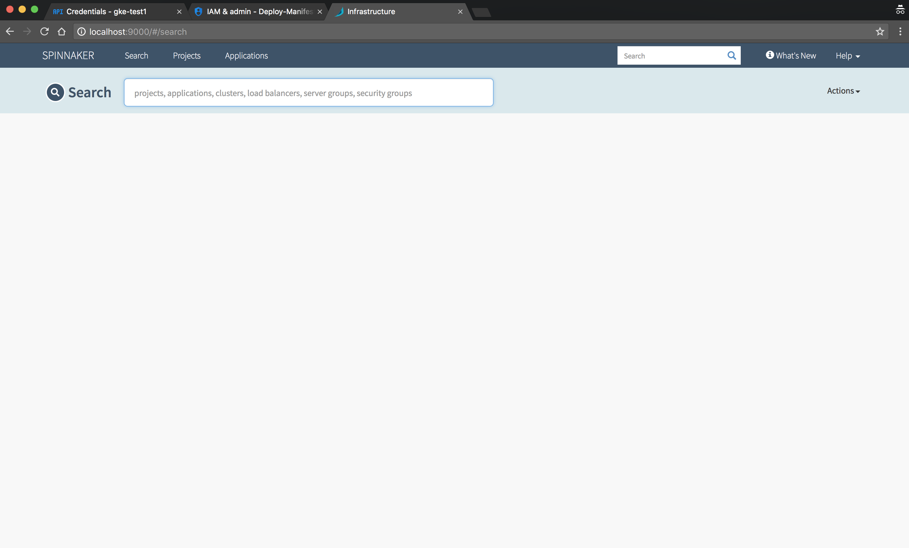

Oauth commands with client id and client secret values :

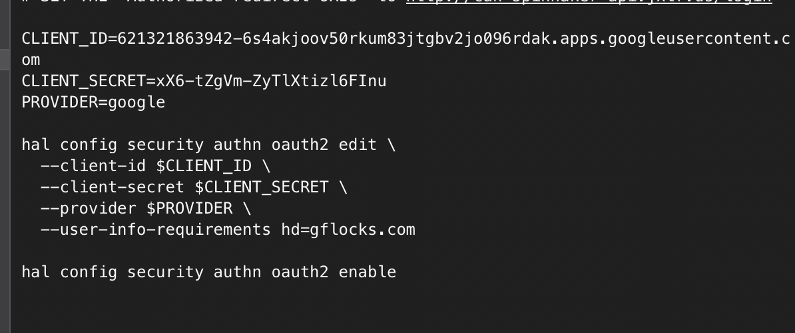

Go to the Shell Terminal and append the following commands :

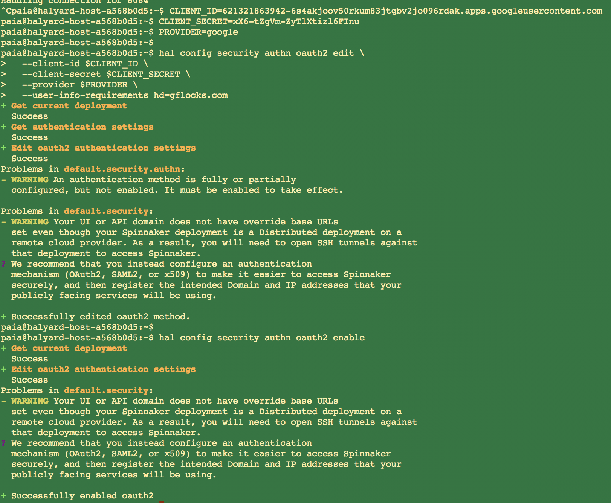

After that execute `hal deploy apply` command :

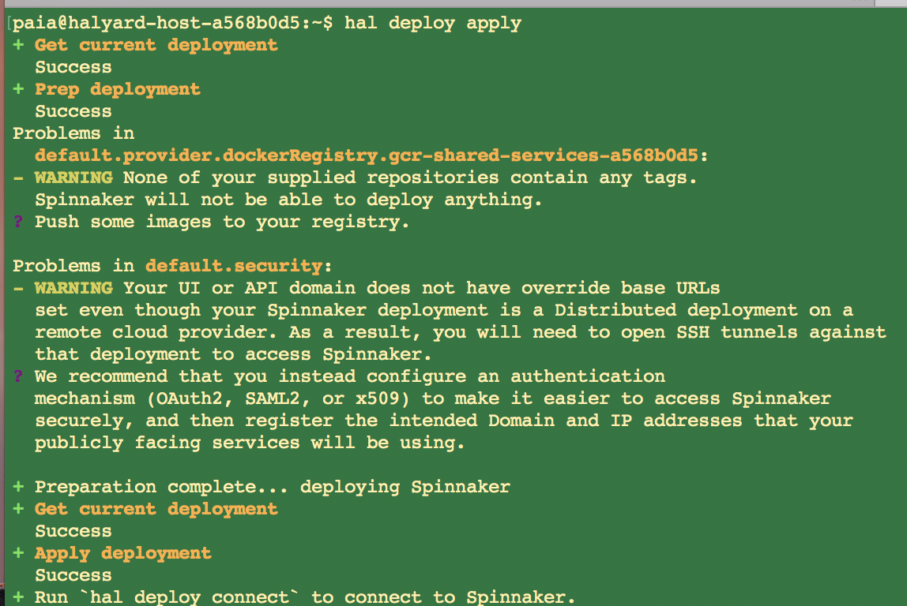

Login to Spinnaker : using http://localhost:9000/

you will be redirected to your google account in the browser

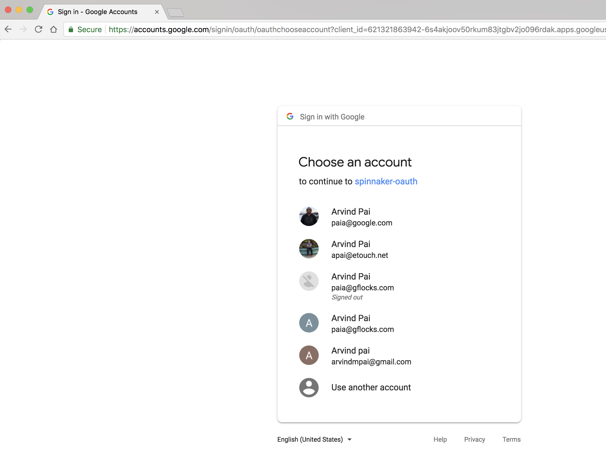

after selecting your appropriate google account, u will be redirected to Spinnaker.

You can view your gflocks account id near the `Search` option

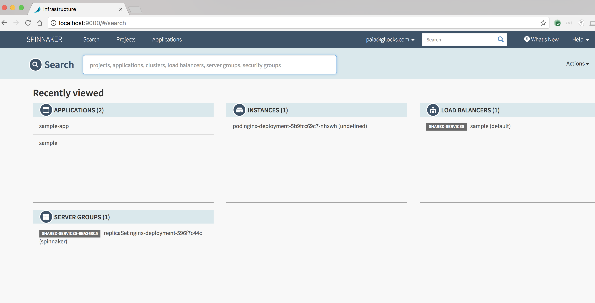

Can logout of the screen once any work is completed.

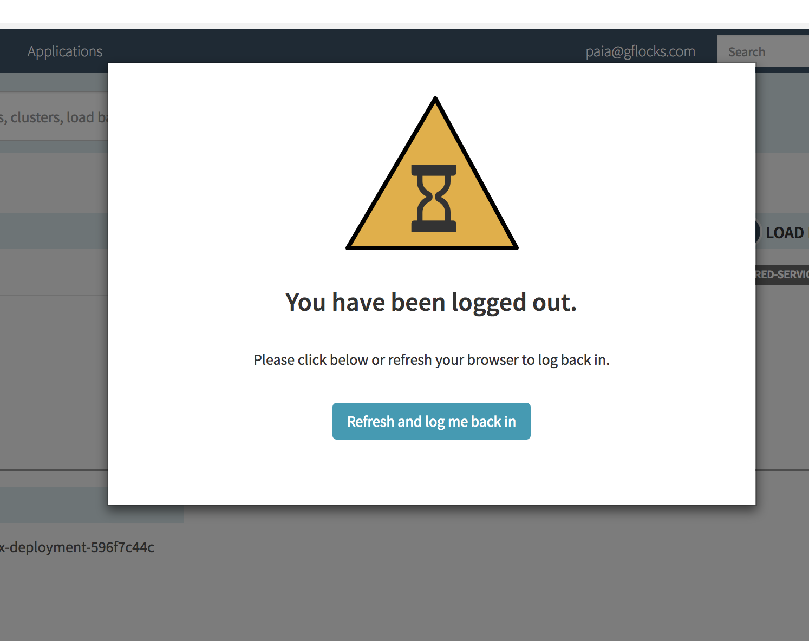

#### Reference URL's:

[Spinnaker authentication with OAuth 2.0](https://www.spinnaker.io/setup/security/authentication/oauth/providers/google/)